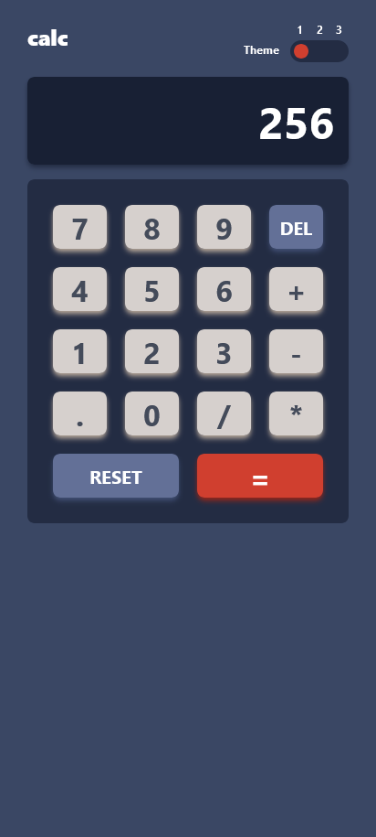

# Frontend Mentor - Calculator app solution

This is a solution to the [Calculator app challenge on Frontend Mentor](https://www.frontendmentor.io/challenges/calculator-app-9lteq5N29). Frontend Mentor challenges help you improve your coding skills by building realistic projects. 

## Table of contents

- [Overview](#overview)
  - [The challenge](#the-challenge)
  - [Screenshot](#screenshot)
  - [Links](#links)
- [My process](#my-process)
  - [Built with](#built-with)
  - [What I learned](#what-i-learned)
- [Author](#author)

## Overview

### The challenge

Users should be able to:

- See the size of the elements adjust based on their device's screen size
- Perform mathmatical operations like addition, subtraction, multiplication, and division
- Adjust the color theme based on their preference
- **Bonus**: Have their initial theme preference checked using `prefers-color-scheme` and have any additional changes saved in the browser

### Screenshot





### Links

- Solution URL: [Solution URL](https://github.com/abdul-haseeb123/react-calculator)
- Live Site URL: [live site URL](https://abdul-haseeb123.github.io/react-calculator/)

## My process

### Built with

- Semantic HTML5 markup
- Mobile-first workflow
- [Tailwind CSS](https://tailwindcss.com/) - For styles
- [React](https://reactjs.org/) - JS library


### What I learned

I learned how to create your own theme in Tailwind CSS and how to use it in React.
```js
// tailwind.config.js
/** @type {import('tailwindcss').Config} */
export default {
  content: ["./index.html", "./src/**/*.{js,ts,jsx,tsx}"],
  theme: {
    colors: {
      transparent: "transparent",
      current: "currentColor",
      white: "hsl(0, 0%, 100% )",
      desaturatedblue: {
        500: "hsl(225, 21%, 49% )",
        600: "hsl(224, 28%, 35% ) ",
        700: "hsl(222, 26%, 31% )",
        800: "hsl(223, 31%, 20% )",
        900: "hsl(224, 36%, 15% )",
      },
      red: "hsl(6, 63%, 50% )",
      darkRed: "hsl(6, 70%, 34% )",
      lightGrayishOrange: "hsl(30, 25%, 89% )",
      grayishOrange: "hsl(28, 16%, 65% )",
      darkGrayishBlue: "hsl(221, 14%, 31% )",
      gray: {
        50: "hsl(0, 0%, 93% )",
        100: "hsl(0, 0%, 90% )",
        150: "hsl(0, 5%, 81% )",
      },
      darkCyan: "hsl(185, 42%, 37% )",
      veryDarkCyan: "hsl(185, 58%, 25% )",
      orange: "hsl(25, 98%, 40% )",
      darkOrange: "hsl(25, 99%, 27% )",
      lightGrayishYellow: "hsl(45, 7%, 89% )",
      darkGrayishOrange: "hsl(35, 11%, 61% )",
      veryDarkGrayishYellow: "hsl(60, 10%, 19% )",
      violet: {
        600: "hsl(268, 47%, 21% )",
        700: "hsl(281, 89%, 26% )",
        900: "hsl(268, 71%, 12% )",
        950: "hsl(268, 75%, 9% )",
      },
      pureCyan: "hsl(176, 100%, 44%)",
      softCyan: "hsl(177, 92%, 70%)",
      magenta: {
        vivid: "hsl(285, 91%, 52% )",
        dark: "hsl(290, 70%, 36% )",
      },
      lightYellow: "hsl(52, 100%, 62% )",
      veryDarkBlue: "hsl(198, 20%, 13% )",
    },
    extend: {},
  },
  plugins: [],
};

```
I also learned how to create visually appearing toggle buttons using TailwindCSS. I also learned the best way to conditionally add classes to your tailwind project using **clsx** and **tailwind-merge**.
```jsx
 <button
                className={cn("relative h-6 w-16 rounded-full", {
                  "bg-desaturatedblue-800": theme == "theme1",
                  "bg-gray-150": theme == "theme2",
                  "bg-violet-900": theme == "theme3",
                })}
                onClick={handleThemeChange}
              >
                <span
                  className={cn(
                    "absolute left-11 top-1 h-4 w-4 rounded-full bg-red transition-all duration-500",
                    {
                      "left-1 bg-red": theme == "theme1",
                      "left-[22px] bg-orange": theme == "theme2",
                      "left-11 bg-softCyan": theme == "theme3",
                    },
                  )}
                ></span>
              </button>
```
## Author

- Frontend Mentor - [@abdul-haseeb123](https://www.frontendmentor.io/profile/abdul-haseeb123)
- LinkedIn - [Abdul Haseeb](https://www.linkedin.com/in/ashaseeb/)
